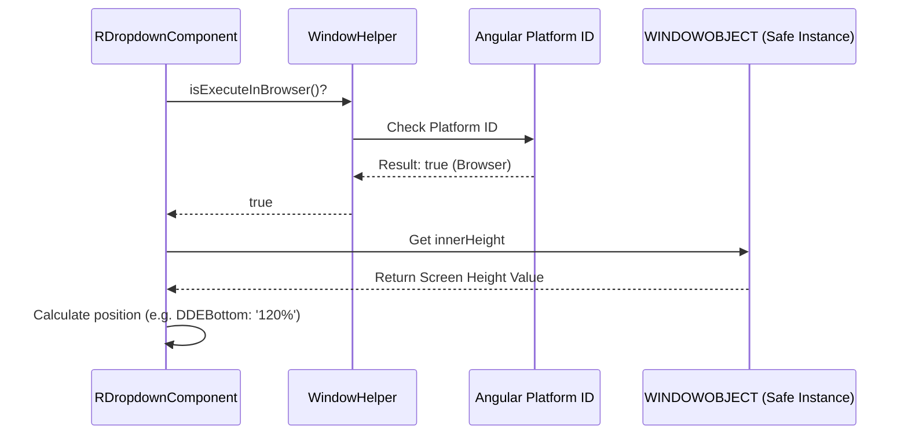

# Chapter 1: Window and Environment Helper

Welcome to the first chapter of the Angular-Controls tutorial! Building professional UI components in Angular requires them to be flexible, reliable, and compatible with modern rendering techniques like Server-Side Rendering (SSR).

This chapter introduces the **Window and Environment Helper**, which is the fundamental layer that makes our controls robust across different execution environments.


## Why Do We Need a Helper? The SSR Problem

In standard web development, we often rely on the global `window` object. This object holds essential browser information, such as the current screen size (`window.innerHeight`), the current URL, and methods for manipulating the Document Object Model (DOM).

However, Angular applications are frequently run on a **server** before being sent to the browser (this is SSR). When the code runs on the server, the global `window` object doesn't exist, leading to immediate crashes if accessed directly.

### The Use Case: Positioning a Popup

Imagine you are building a complex control, like the `RDropdownComponent` or `CalenderComponent` shown in the code snippets. When the user clicks the control, a popup menu needs to appear.

To decide if the menu should open *above* or *below* the input field, we need to know how much vertical space is left on the screen. This calculation requires accessing browser properties like `window.innerHeight` and measuring element positions, as seen in the `AttachDropdown()` method logic:

```typescript
// Simplified logic for positioning the dropdown
AttachDropdown() {
    let windowHeight = this.windowObj.innerHeight; // DANGER! Requires browser environment

    // ... calculate button position (btnPosTop) ...
    let dropDownHeight = 235; 

    // Calculation based on available screen space
    if (windowHeight - btnPosTop < dropDownHeight) {
        // Not enough space below, open above
        this.DDEBottom = '120%';
    } else {
        // Enough space below, open below
        this.DDETop = '110%';
    }
}
```

If the code inside `AttachDropdown()` runs on the server, it would crash when trying to access `this.windowObj.innerHeight`.

The **Window and Environment Helper** provides two crucial concepts to solve this:

1.  A way to safely check if we are in a browser environment (`isExecuteInBrowser`).
2.  A safe, injected version of the `window` object (`WINDOWOBJECT`).

## Key Feature 1: The Safety Gatekeeper

The most important method provided by the helper is `isExecuteInBrowser()`. This function acts as a gatekeeper, ensuring that any code that relies on browser-specific APIs (like DOM manipulation, geometry calculations, or accessing `navigator`) only runs when we are truly executing inside the user's browser.

### How to Use the Safety Check

To use the helper, we first inject it into our component's constructor, just like any other Angular service.

```typescript
// Angular controls/src/app/Controls/Calender/calender.component.ts (Excerpt)

constructor(
    // ...
    windowHelper: WindowHelper, 
    // ...
) {
    super(windowHelper);

    // Use the helper to safely check the environment 
    if (windowHelper.isExecuteInBrowser()) {
      this.IsWindowsOs = navigator.platform == "Win32";
      this.IsLinuxOs = navigator.platform.toLowerCase().includes("linux");
    }
    // ...
}
```

In this example, accessing `navigator.platform` (which checks the user's OS) is a browser-only operation. By wrapping it in `if (windowHelper.isExecuteInBrowser())`, we prevent crashes during SSR.

## Key Feature 2: Generating Unique IDs

Controls often need unique identifiers (IDs) for elements within their templates. This is necessary for linking inputs to labels, managing accessibility, or ensuring that CSS rules target the correct instance.

The `WindowHelper` provides a simple utility method, `GenerateUniqueId()`, that works reliably in both browser and server environments.

### How to Generate an ID

We use this helper immediately in the component's constructor:

```typescript
// Angular controls/src/app/Controls/dropdown/dropdown.component.ts (Excerpt)

constructor(
    // ...
    private windowHelper: WindowHelper,
    // ...
) {
    super(windowHelper);
    
    // Assign a globally unique ID to this component instance
    this.Id = windowHelper.GenerateUniqueId();
    // This ID is used throughout the component's template and logic.
}
```

This method creates a unique string every time it is called (usually based on the current timestamp and a random number).

## Under the Hood: The Internal Implementation

How does Angular know if it's running on a server or a browser?

Angular provides an `InjectionToken` called `PLATFORM_ID`. The value of this token changes depending on whether the application is bundled for the browser or for Node.js (the typical SSR environment).

The `WindowHelper` uses this Angular mechanism:

```typescript
// Angular controls/src/app/Controls/windowObject.ts (WindowHelper simplified)

import { isPlatformBrowser } from "@angular/common";
import { Injectable, PLATFORM_ID, inject } from "@angular/core";

@Injectable({ providedIn:'root' })
export class WindowHelper {

    private platformId = inject(PLATFORM_ID);    

    isExecuteInBrowser(): boolean{
        // This function checks the value of PLATFORM_ID
        return isPlatformBrowser(this.platformId);
    }
    
    // ... GenerateUniqueId implementation ...
}
```

### The Safe `window` Object (`WINDOWOBJECT`)

Even with the `isExecuteInBrowser()` check, sometimes components need access to the raw `window` object for complex calculations (like in our positioning use case). We cannot inject the raw global `window` directly because it would fail during SSR.

Instead, Angular Controls defines a specialized **Injection Token** called `WINDOWOBJECT`.

```typescript
// Angular controls/src/app/Controls/windowObject.ts (WINDOWOBJECT simplified)

export const WINDOWOBJECT = new InjectionToken<Window>('global window object', {
    factory:()=> {
        if(typeof window !== 'undefined') {
            return window // Return the real browser window object
          }
          // On the server (SSR), return a dummy object that doesn't crash
          return new Window(); 
    }
});
```

When the component needs to interact with `window` properties (like `innerHeight` or adding event listeners), it injects this safe token:

```typescript
// Angular controls/src/app/Controls/Calender/calender.component.ts (in constructor)

private windowObj!: Window; 
// ...
this.windowObj = inject(WINDOWOBJECT);
```

By injecting `WINDOWOBJECT`, the component gets the real `window` object in the browser, but a safe placeholder on the server. Although we have this safe object, it is still crucial to use the `WindowHelper` to check the environment before trying to execute sensitive actions (like adding event listeners or reading layout dimensions) to ensure they work as expected.

### Summary of How the Helper Protects Layout

Consider the flow when a component uses the `WindowHelper` to decide where to position a floating element:



If `isExecuteInBrowser()` returned false (SSR environment), the component would skip the logic, preventing crashes and relying on the basic server-rendered HTML until the client-side takes over.

| Feature | Provided By | Purpose | SSR Safe? |
| :--- | :--- | :--- | :--- |
| Environment Check | `WindowHelper` | Tells if code runs in a browser. | Yes |
| Unique ID Generation | `WindowHelper` | Creates guaranteed unique identifiers. | Yes |
| Access to Global Window | `WINDOWOBJECT` | Provides a safely injected Window instance. | Yes (returns dummy on server) |

## Conclusion and Next Steps

The `WindowHelper` provides the essential safety net for building robust, environment-agnostic Angular controls. By centralizing the logic for platform detection and essential utilities like unique ID generation, it ensures that our components can handle Server-Side Rendering without crashing, while still allowing complex layout calculations when running in the user's browser.

In the next chapter, we will introduce the [RBaseComponent](02_rbasecomponent_.md). This is a base class that all our custom controls will inherit from, and it’s where we will integrate the `WindowHelper` immediately to ensure every component starts with SSR safety built-in.

[RBaseComponent](02_rbasecomponent_.md)
