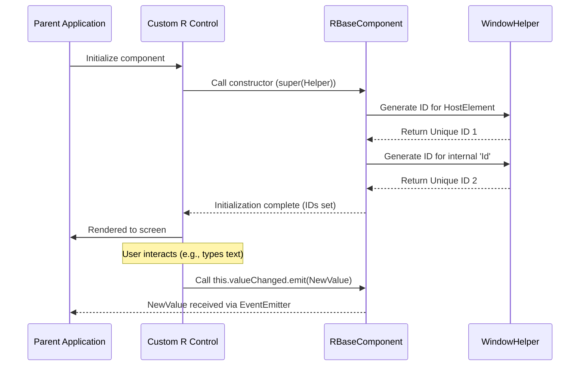

# Chapter 2: RBaseComponent

In the previous chapter, we learned about the [Window and Environment Helper](01_window_and_environment_helper_.md) and how it provides essential tools like environment detection (for SSR safety) and unique ID generation.

Now, we introduce the **RBaseComponent**, the fundamental building block that ensures every custom control in this library automatically utilizes these foundational features and maintains a consistent structure.

---

## The Need for a Foundation Class

Imagine you are building ten different UI controls—a checkbox, a color picker, a dropdown, a slider, etc. Every single one of these controls needs three things:

1.  **A Unique Identity:** Every instance needs a guaranteed unique ID (like a social security number for the component) for accessibility and internal logic (e.g., linking a label to an input field).
2.  **Context Awareness:** It must know if it's running in a browser or on a server, inheriting SSR safety via the `WindowHelper`.
3.  **Communication:** A standardized way to notify its parent component when the user changes its value.

Instead of writing this setup code in *every* component, we centralize it in the `RBaseComponent`. All our custom controls (`RCheckboxComponent`, `RGridComponent`, etc.) simply **inherit** from `RBaseComponent`.

Think of the `RBaseComponent` as a standardized blueprint that guarantees every component starts life with the necessary security and communication features pre-installed.

## Key Feature 1: Automatic Unique IDs

The primary job of the `RBaseComponent` is to call the `WindowHelper` immediately upon creation and assign unique IDs.

When a control is initialized, it gets two primary IDs:

1.  **`Id`:** Used for internal elements within the component's template (e.g., the `<input>` element).
2.  **`HostElementId`:** Automatically assigned to the component's root HTML tag (the host element), making it easy to target with global CSS or JavaScript if needed.

### Using Generics `<T>`

Notice the syntax `RBaseComponent<T>`. The `<T>` (a generic type) means the component can handle any type of data.

*   If you build a numeric input, `T` might be `number`.
*   If you build a date picker, `T` might be `Date`.
*   If you build a complex grid, `T` might be an array of objects.

This allows the base class to handle value changes correctly regardless of what the control holds.

## Key Feature 2: Standardized Communication (`valueChanged`)

Angular components often communicate back to their parent containers using `@Output()` properties (EventEmitters).

The `RBaseComponent` enforces a standard notification mechanism called `valueChanged`. This is an `EventEmitter` that carries the new value of the component whenever the underlying data changes.

### Example: Notifying Parent of a Change

Let's look at how the `RBaseComponent` is used inside a simplified checkbox control:

```typescript
// Simplified RCheckboxComponent inheriting RBaseComponent<CheckboxEventArgs>

export class RCheckboxComponent extends RBaseComponent<CheckboxEventArgs> {

  // IDs are automatically generated here!

  constructor(windowHelper: WindowHelper) {
    // We pass the helper to the base class constructor
    super(windowHelper); 
  }

  toggleCheck(event: Event) {
    // Toggle the internal state
    let checkValue = !this.IsChecked; 
    this.IsChecked = checkValue;

    // Create the event arguments 
    let args = new CheckboxEventArgs(event, this.IsChecked);
    
    // Use the standard EventEmitter provided by RBaseComponent
    this.valueChanged.emit(args); 
  }
}
```

By consistently using `this.valueChanged.emit(newValue)`, any developer using an R Control knows exactly which event to subscribe to if they want to track the component’s data.

## Under the Hood: The Inheritance Flow

When a custom control is created, the process ensures that the base class initializes first, guaranteeing that the unique IDs and the `WindowHelper` safety net are established immediately.

### RBaseComponent Implementation (Simplified)

The core structure of the base class is straightforward:

```typescript
// Angular controls/src/app/Controls/Models/RBaseComponent.ts

import { Directive, EventEmitter, HostBinding, Output } from "@angular/core";
import { WindowHelper } from "../windowObject";

// The <T> placeholder allows us to specify the data type later.
@Directive()
export abstract class RBaseComponent<T> {

    Id: string = '';

    // @HostBinding links this property to the component's HTML tag
    @HostBinding('id')
    HostElementId: string = this.winObj.GenerateUniqueId();
    
    @Output()
    valueChanged = new EventEmitter<T>(); // Standard output for value changes

    constructor(protected winObj: WindowHelper) {
        // Step 1: Initialize context safety (WindowHelper)
        // Step 2: Generate the internal ID
        this.Id = this.winObj.GenerateUniqueId();
    }
}
```

The use of `protected winObj: WindowHelper` means that any component inheriting from `RBaseComponent` can access the `WindowHelper` functionality easily (e.g., calling `this.winObj.isExecuteInBrowser()`) without needing to redeclare it.

### Sequence of Initialization

The following diagram illustrates the lifecycle of a component inheriting from `RBaseComponent`:



| Property | Type | Provided By | Purpose |
| :--- | :--- | :--- | :--- |
| `winObj` | `WindowHelper` | Constructor | Provides environment safety (SSR). |
| `Id` | `string` | Base Class | Unique ID for internal template elements. |
| `HostElementId` | `string` | Base Class | Unique ID for the component's root tag. |
| `valueChanged` | `EventEmitter<T>` | Base Class | Standardized output event for data changes. |

## Conclusion and Next Steps

The `RBaseComponent` is the cornerstone of the Angular Controls library. It provides a consistent, robust foundation for all custom controls by seamlessly integrating environment safety (via the `WindowHelper`) and standardized communication (`valueChanged`). This centralization drastically reduces boilerplate code and improves maintenance across the entire library.

In the next chapter, we will look at the [CssUnitsService](03_cssunitsservice_.md), a utility that helps our controls handle complex sizing and positioning using various CSS units like `px`, `em`, and `%`, ensuring components scale properly in any layout.

[CssUnitsService](03_cssunitsservice_.md)
