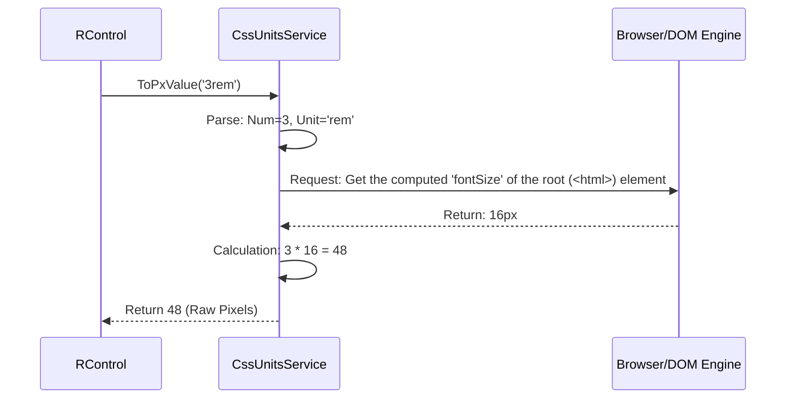

# Chapter 3: CssUnitsService

In the first two chapters, we established the basic safety net for our components using the [Window and Environment Helper](01_window_and_environment_helper_.md) and standardized our component structure with the [RBaseComponent](02_rbasecomponent_.md).

Now, we tackle one of the trickiest parts of building responsive UI controls: **dynamic sizing and positioning**.

In standard CSS, dimensions can be specified using dozens of different units, such as `px` (pixels), `rem` (relative to the root element’s font size), or `%` (percentage of the parent).

When a component, like a dropdown, needs to pop up and check if it fits on the screen, it must perform complex geometry calculations. These calculations are impossible if the size is only known in relative units.

This is where the **`CssUnitsService`** comes in. It acts as a universal translator, converting *any* valid CSS measurement string into a concrete, absolute pixel (`px`) value.

## Under the Hood: How the Translation Happens

The `CssUnitsService` cannot simply guess the pixel value; it relies on low-level browser APIs to perform the calculation exactly as the browser would.

Here is a simplified sequence of what happens when you ask the service to convert a relative unit like `rem`:

The service encapsulates several different conversion techniques, primarily relying on two powerful browser features:

### 1. Handling Relative Units (`rem`, `em`, `vw`, `%`)

For units that depend on other elements or the viewport size, the service uses `getComputedStyle()`. This function forces the browser to calculate the final rendered size of an element.

For example, to convert a percentage (`%`) based on the parent's height:

### 2. Handling Absolute Units (`pt`, `cm`, `mm`, etc.)

Although rarely used, the service must also handle physical absolute units (points, centimeters). For these, it uses a trick involving the SVG (Scalable Vector Graphics) DOM API, which is designed to convert between various length types accurately:

By abstracting these complex DOM interactions, the `CssUnitsService` provides a clean, reliable, and consistent `ToPxValue` method for every component built in the Angular Controls library.

## Conclusion and Next Steps

The `CssUnitsService` is vital for ensuring that complex controls maintain a professional, dynamic layout. It converts potentially ambiguous CSS sizes (like `rem` or `%`) into concrete pixel measurements, which are essential for accurate geometry checks (like deciding if a popup fits on the screen).

With the foundation of environment safety ([Window and Environment Helper](01_window_and_environment_helper_.md)), structured components ([RBaseComponent](02_rbasecomponent_.md)), and now precise layout measurement, our controls are ready to handle advanced UI scenarios.

In the next chapter, we will look at the **[CloseService (Popup Management)](04_closeservice__popup_management__.md)**, which uses these layout calculations to manage when and how pop-up elements (like dropdown menus and calendars) should automatically close when the user interacts outside of them.

[CloseService (Popup Management)](04_closeservice__popup_management__.md)
