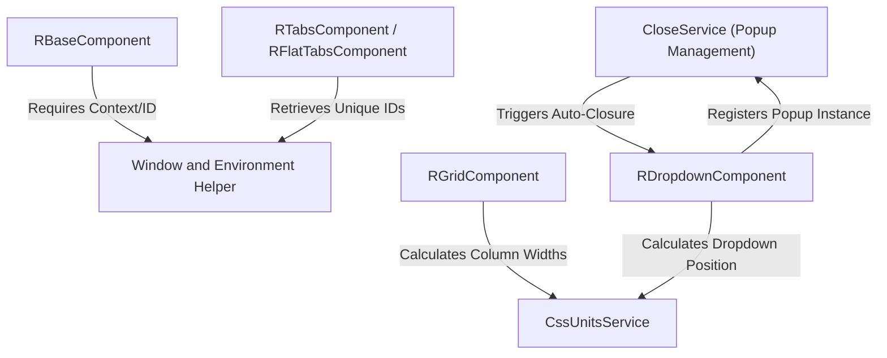

# Tutorial: Angular-Controls

This project is under development which can offers a comprehensive suite of reusable Angular UI components, known as R controls (like RDropdown, RGrid, RCalender). The core functionality focuses on providing robust cross-platform compatibility, especially for Server-Side Rendering (SSR), achieved through the *Window and Environment Helper*. All controls inherit from **RBaseComponent**, ensuring unique identification and standardized event emissions. Key complexity lies in dynamically handling component dimensions using the **CssUnitsService** and orchestrating non-overlapping display of popups and overlays via the **CloseService**.

## Visual Overview

## Chapters

1. [Window and Environment Helper
](01_window_and_environment_helper_.md)
2. [RBaseComponent
](02_rbasecomponent_.md)
3. [CssUnitsService
](03_cssunitsservice_.md)

